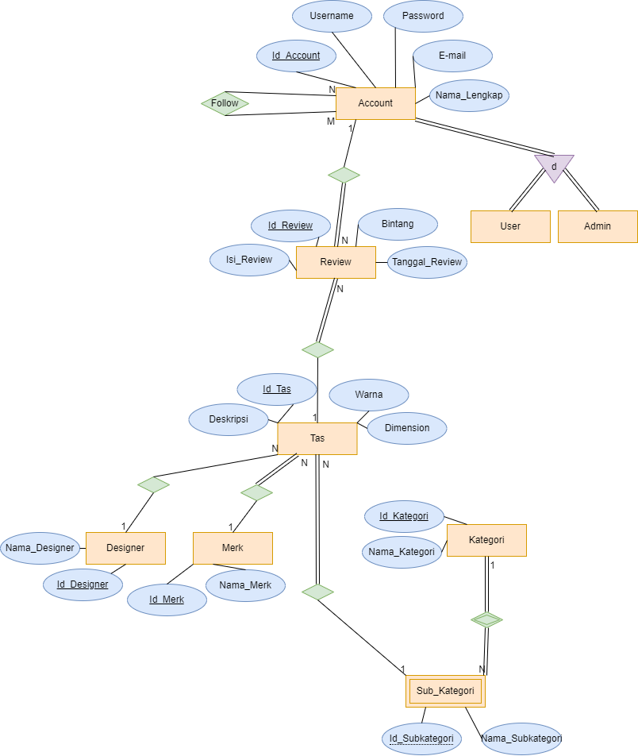

# ERD yang akan digunakan dalam basis data

Gambar ERD :

## USER

Id_Account (PK)
Username
Password
E-mail
Nama_Lengkap

## ADMIN

Id_Account (PK)
Username
Password
E-mail
Nama_Lengkap
Id_Admin

## FOLLOW

Id_Account (PK,FK)
Id_Follower (PK,FK)

## REVIEW

Id_Review(PK)
Isi_Review
Bintang
Tanggal_Review
Id_Account(FK)
Id_Tas(FK)

## TAS

Id_Tas(PK)
Deskripsi
Warna
Dimensi
Id_Merk(FK)
Id_Designer(FK)
Id_Kategori(FK)
Id_Subkategori(FK)

## MERK

Id_Merk(PK)
Nama_Merk

## DESIGNER

Id_Designer(PK)
Nama_Designer

## KATEGORI

Id_Kategori(PK)
Nama_Kategori
Id_Admin(FK)

## SUB_KATEGORI

Id_Subkategori(PK)
Nama_Subkategori
Id_Kategori(PK,FK)
Id_Admin(FK)
